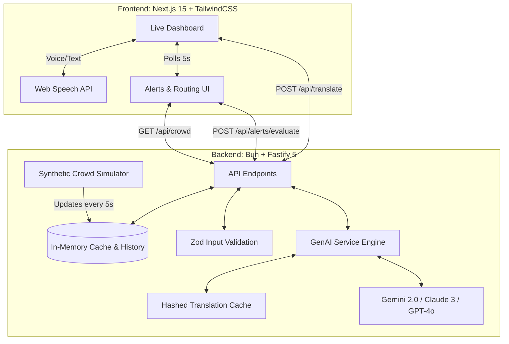

# Volunteer Co-Pilot 🏟️✈️

**A GenAI-powered dashboard for stadium volunteers during FIFA World Cup 2026**

---

## 1. Chosen Vertical

**Vertical:** Event Operations, Stadium Management, and Crowd Safety.

### The Persona
**Stadium volunteers** — the thousands of temporary ground-level staff managing gates, directing crowds, and assisting international fans. They work under intense pressure, in loud environments, without instant access to supervisors, translation tools, or command centers.

### The Problem
During massive events like the FIFA World Cup 2026:
1. **Crowd Congestion & Safety:** Gate crowding can lead to bottlenecks, delays, and dangerous crushing hazards. Volunteers have no real-time visibility into other gates and must rely on radio chatter.
2. **Language Barriers:** Fans arrive from dozens of nations. A volunteer speaking only English or Spanish cannot easily give evacuation or medical instructions to fans speaking French, Arabic, Hindi, or Portuguese.

---

## 2. Approach and Logic

Volunteer Co-Pilot uses a modern **Client-Server Architecture** designed for high reliability and sub-second operational decisions:



### In-Memory State & Simulation
* **Real-time Simulation:** Since actual IoT stadium gate sensors are unavailable, a background synthetic simulator generates realistic occupancy and flow rates for 6 gates, updating every 5 seconds.
* **Flow Trends:** Gates simulate varying trends (`rising`, `falling`, `stable`) to mimic real stadium entry rushes.

### GenAI Routing and Reasoning
* **Real-time Evaluator:** When a gate crossed the critical threshold (**>= 80%** occupancy), a GenAI engine (defaulting to **Gemini 2.0 Flash**) is called.
* **Context-Aware Recommendations:** Instead of static alerts, the LLM evaluates the occupancy of all gates and returns a targeted rerouting action plus a plain-English justification (e.g., *"Redirect incoming fans to Gate D, which is at 35% occupancy and only 120m away"*).
* **Fault-Tolerant Fallback:** If the LLM call fails due to rate limits or network issues, the backend immediately intercepts the error and returns a deterministic, rules-based fallback alert (e.g., redirecting to the gate with the absolute lowest occupancy) so the dashboard never breaks down in a crisis.

---

## 3. How the Solution Works

### Step-by-Step Flow
1. **Sensor Updates:** The synthetic simulator pushes gate occupancy updates.
2. **Dashboard Rendering:** The frontend polls `/api/crowd` every 5 seconds to display a colored density grid (Green `< 50%`, Yellow `50% - 79%`, Red `>= 80%`).
3. **Smart Alert Triggering:** If a gate capacity crosses the 80% mark, the frontend invokes `/api/alerts/evaluate`.
4. **GenAI Evaluation:** The backend queries the GenAI service, fetching a tailored action plan.
5. **Volunteer Action:** The volunteer receives a clear instruction to call out or display.
6. **Translation & Speech:** 
   * The volunteer selects a preset script or inputs a custom phrase (via typing or voice dictation using the **Web Speech API**).
   * The frontend calls `/api/translate` with target language, intent, and urgency levels.
   * The backend generates the translated string along with a phonetic pronunciation guide so the volunteer can speak it aloud.

### Core API Endpoints
* `GET /api/crowd` - Retrieves latest gate occupancies.
* `POST /api/alerts/evaluate` - Evaluates gate capacities and triggers GenAI context recommendations.
* `PATCH /api/alerts/:id/dismiss` - Allows volunteers to dismiss alerts.
* `POST /api/translate` - Performs translation and provides romanized pronunciation guides.

---

## 4. Assumptions Made

1. **Network Connectivity:** The app assumes the volunteer has cellular or stadium Wi-Fi connectivity. If connectivity is severed, it falls back to hardcoded safety dictionaries and local rules.
2. **Scale Limits:** In-memory caching for translations is optimized for memory size (djb2 hash keys) assuming a max vocabulary footprint of ~500 active phrases per gate.
3. **Simulated Gates:** We assume a static setup of 6 gates named A through F, representing a single concourse quadrant.
4. **Local Browser Speech API:** Speech-to-text relies on the browser's native `webkitSpeechRecognition` implementation.

---

## 5. Evaluation Focus Areas

### 💻 Code Quality
* **Clean Code Architecture:** Separate concerns via Router-Controller-Service patterns. Thin controller actions, fat service logic.
* **TypeScript Integrity:** Complete type definitions across all files; `tsconfig.json` configurations are optimized for modern module resolution without warning suppression.
* **Zod Schemas:** Strict request parsing using Zod ensuring validation errors are caught before hitting business logic.

### 🔒 Security
* **Helmet Headers:** Registers `@fastify/helmet` to set secure HTTP headers (e.g. XSS protection, Content Security Policy).
* **Rate Limiting:** Protects endpoints using `@fastify/rate-limit` capped at 100 requests per minute per IP.
* **XSS Defenses:** Client-side user inputs are fully sanitized to neutralize script injection.
* **Input Validation:** Reject negative occupancies, invalid gate characters, oversized payloads (max 500 chars for translation), and unknown language codes.

### ⚡ Efficiency
* **Hashed Translation Cache:** Uses a constant-memory Map with an auto-sweeping background timer (5 min TTL) to avoid hitting GenAI APIs for identical phrases. Cache keys are djb2 hashes of the parameters to avoid storing long text strings in memory.
* **Lightweight Bundle:** Minimum dependencies on both frontend and backend for immediate load times on mobile devices.
* **Debounced Polls:** Poll intervals are tightly controlled and stop when tabs are out of focus.

### 🧪 Testing
* **High Coverage Test Suite:** 157 unit and integration tests covering:
  * Validator schema rejections.
  * Controller success/fallback logic.
  * Cache TTL evictions and max capacity limits.
  * LLM response parsing (markdown fence stripping, invalid JSON mitigation).
* **Mock Isolation:** Fully mocks external API fetch calls to prevent flaky network errors during CI/CD.

### ♿ Accessibility (a11y)
* **Inclusive Visuals:** Status indicators do not rely on color alone. Red/yellow/green states are accompanied by clear labels ("CRITICAL", "WARNING", "OK") and iconography.
* **Screen Reader Support:** Fully compatible with screen readers using semantic HTML5 landmarks and live status alerts (`aria-live="polite"`).
* **Keyboard Navigation:** Fully navigable via Tab/Shift+Tab with visible focus rings.
* **I18n Localization:** Fully localized UI toggle supporting both English and Spanish translations.

---

## 6. Setup & Execution

### Prerequisites
* [Bun](https://bun.sh) v1.2+
* An active Gemini, OpenAI, or Anthropic API Key.

### Installation
```bash
# Clone the repository
git clone <repo-url>
cd volunteer-co-pilot

# Install & Run Backend
cd backend
cp .env.example .env   # Add API Key here
bun install
bun dev

# Install & Run Frontend (New terminal)
cd frontend
bun install
bun dev
```

### Running Tests
```bash
# Run backend tests
cd backend && bun test

# Run frontend tests
cd frontend && bun test
```